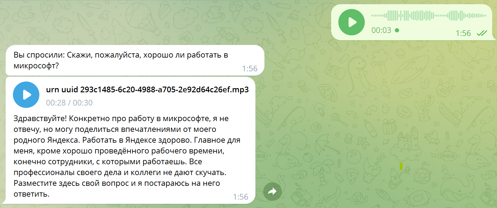

# Создаём вопрос-ответного чат-бота по видео

В последнее время, с появлением больших языковых разговорных моделей (*Large Language Models, LLM*), таких, как [Yandex GPT](https://cloud.yandex.ru/services/yandexgpt), актуальным становится вопрос создания предметно-ориентированных чат-ботов, т.е. таких разговорных чат-ботов, которые способны поддерживать беседу в рамках какой-то узкой предметной области. Такие чат-боты могут быть реализованы двумя путями:

* **До-обучение разговорной модели** - это, как правило, требует значительных вычислительных мощностей, усилий и опыта, и при этом любые изменения в предметной области требуют пере-обучения модели
* **Retrieval-Augmented Generation** - подход, при котором ответ чат-бота формируется стандартной предобученной LLM-моделью, но предварительно ей показывают фрагменты текста из предметно-ориентированной базы знаний, найденные с помощью семантического поиска.

В рамках данного мастер-класса мы создадим вопрос-ответного чат-бота с помощью подхода Retrieval-Augmented Generation, на основе набора видео-файлов. Мы используем [Yandex SpeechKit](https://cloud.yandex.ru/services/speechkit) для преобразования звуковой дорожки видео в текстовый корпус, после чего организуем векторное хранилище и индексацию с помощью [текстовых эмбеддингов Yandex GPT](https://cloud.yandex.ru/docs/yandexgpt/api-ref/Embeddings/) и фреймворка [LangChain](https://www.langchain.com/). В заключении, мы реализуем телеграм-бота, который способен отвечать на текстовые и голосовые запросы.

Подробные комментарии содержатся в файлах проекта, которые рекомендуется открыть в [Yandex DataSphere](https://cloud.yandex.ru/services/datasphere).

## Этапы работы

Вся работа состоит из следующих основных этапов:

1. [PrepareDataset.ipynb](PrepareDataset.ipynb) - подготовка текстов для поиска из семейства видео. На вход мы получаем набор ссылок на видео на YouTube, скачиваются звуковые дорожки, преобразуются в нужный формат и далее вызывается Yandex SpeechKit для преобразования речи в текст.
1. [LangChainQA.ipynb](LangChainQA.ipynb) - основной код для вопрос-ответного бота на основе LangChain. Здесь текстовые материалы разбиваются на фрагменты, индексируются с помощью эмбеддингов и сохраняются в векторную базу данных. Затем по запросу из базы данных извлекаются релевантные документы, и подаются на вход модели Yandex GPT. В этом же ноутбуке мы разрабатываем простые адаптеры LangChain для Yandex GPT Embeddings и Yandex GPT LLM.
1. [telegram.py](telegram.py) - код телеграм-бота на основе фреймворка flask. Этот скрипт размещается на виртуальной машине.

Чтобы начать работу, вам необходимо проделать следующие подготовительные операции:

1. Получить доступ к Яндекс-облаку - например, в рамках [пробного периода](https://cloud.yandex.ru/docs/free-trial/)
1. Создать в облаке объектное хранилище s3 (в рамках мастер-класса используется имя `s3store`)
1. Создать в облаке [сервисные аккаунты](https://cloud.yandex.ru/docs/iam/concepts/users/service-accounts), имеющие доступ к SpeechKit, YandexGPT и объектному хранилищу. Для каждого из сервисных аккаунтов создать [API-ключи](https://cloud.yandex.ru/docs/iam/concepts/authorization/api-key) ([инструкция](https://cloud.yandex.ru/docs/iam/operations/api-key/create)), и параметры этих ключей прописать в файле [config.json](config.json).

## Этапы работы

Данный мастер-класс рекомендуется проводить в [Yandex DataSphere](https://cloud.yandex.ru/services/datasphere). В рамках мастер-класса вам будет предоставлен доступ в проект DataSphere, в котором вам будет необходимо:

1. Подключить доступ к хранилищу данных `s3store` и активировать его. Коннектор к `s3store` уже настроен в рамках сообщества.
1. 